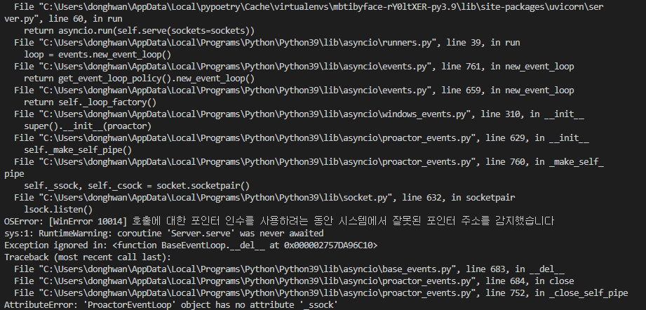
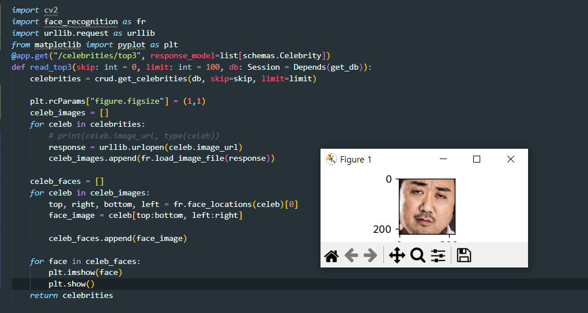
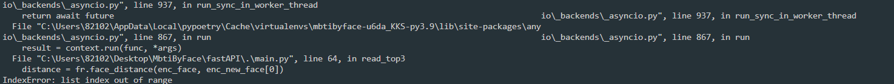
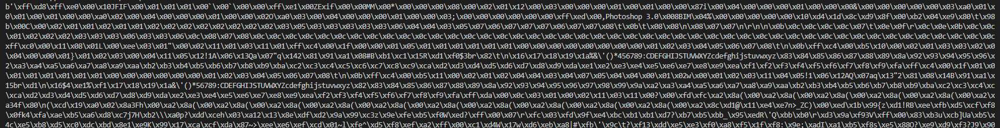
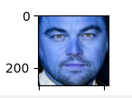
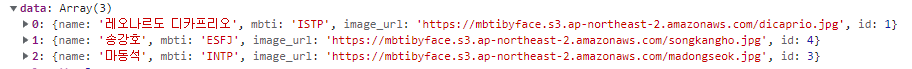
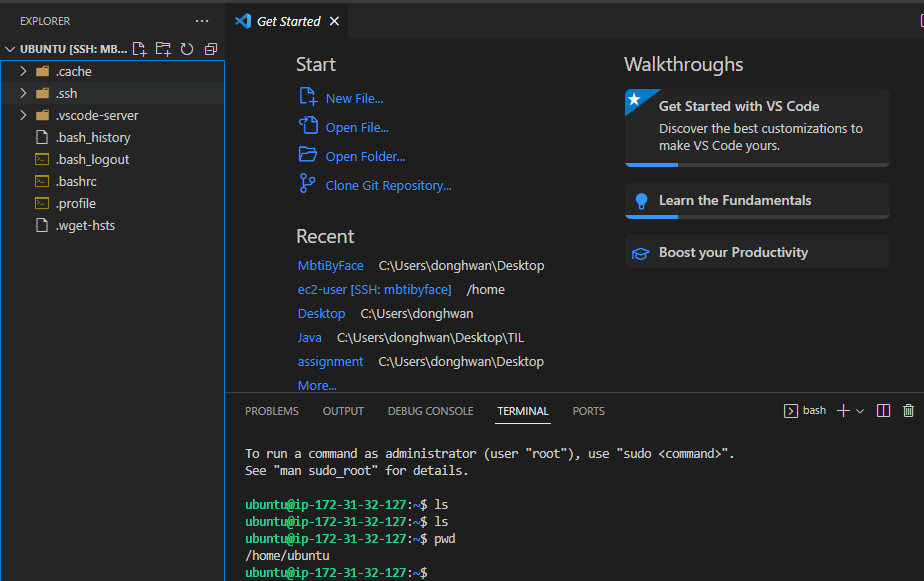
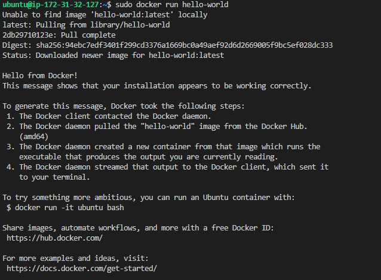
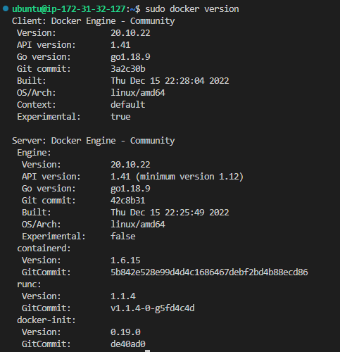

## :female_detective: MbtiByFace

> 얼굴 이미지와 인공지능을 이용하여 얼굴이 가장 비슷한 연예인을 찾고 MBTI를 도출

### 0. 개발일지

#### - 12/07

> 1. python에서 package 인식을 못해서 상대경로 오류뜨는 것
>
>    - `__init__`파일로 해결
>
> 2. mysql 연동 오류
>
>    - 아래와 같은 오류 발생 => 공식문서 따라서 sqlite로 변경
>
>    
>

#### - 12/09

> 1. face_recognition 설치 오류
>
> - visual studio for c++ 설치, [cmake 설치](https://velog.io/@glee623/dlib-%EC%84%A4%EC%B9%98-%EC%98%A4%EB%A5%98)
>
> 2.  `AttributeError: module 'urllib' has no attribute 'request'`
>
> - [참고](https://needneo.tistory.com/146) urllib.request까지 한번에 import 
>
> 3. S3에서 image_url 이용하여 사진 속 얼굴 인식 및 분리 
>
> 
>
> - 원래사진 (얼굴 인식 및 분리 전)
>
> 

#### -12/23

> heapq 이용해서 distance 낮은 기준으로 top3 추출
>
> 오류 1.  사용자한테 이미지를 받아서 가공한 뒤, 비교를 해야하는데 비동기로 진행되어서 오류뜨는 것 같음 => 순서대로 처리하기
>
> 
>
> 개선할 것 1. crud에서 idx 리스트를 받아서 db에서 추출해오는 filter 함수 만들기
>
> 현재는 for문으로 하나씩 찾아서 리스트에 넣는 방식

#### -12/26

> 1. [byte 코드 => 이미지 파일](https://ballentain.tistory.com/50)
>    - 클라이언트에서 jpg파일 보내면 서버에서 binary 형태로 받아지는데 numpy랑 cv2 이용해서 이미지로 변환
>
> 
>
> 
>
> 문제는 얼굴색이 이상함
>
> 그래도 일단 응답 받는데 성공
>
> 

#### -1/9

> aws ec2 인스턴스 만들고 ssh 접속
>
> 1. pem키 권한 설정
> 2. ubuntu 아닌 amazon linux로 만들어서 (ubuntu로 만들어야함) 
>
> 뭐가 문제인지 찾는데 오래걸렸다.
>
> 
>
>  

#### -1/10

> [ec2 인스턴스 내 docker 설치 완료](https://docs.docker.com/engine/install/ubuntu/#set-up-the-repository)
>
> 
>
> 
