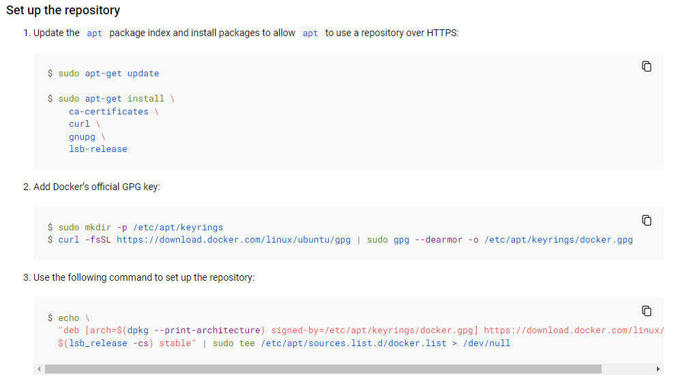
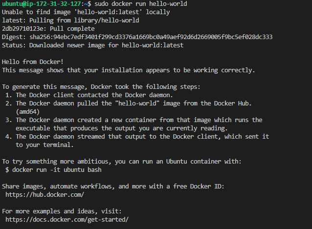
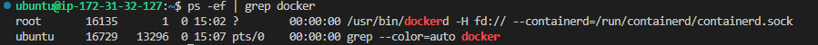

>  [ubuntu docker 설치](https://docs.docker.com/engine/install/ubuntu/#set-up-the-repository)



>  설치완료





<br>

### [FastAPI 배포](https://mopil.tistory.com/m/64)

[참고](https://buildabetterworld.tistory.com/168)

### 0. [poetry 설치]

```bash
# .bashrc
alias python=python3
source ~/.bashrc
```


### 1. nginx 설치

```bash
sudo apt install nginx
```

